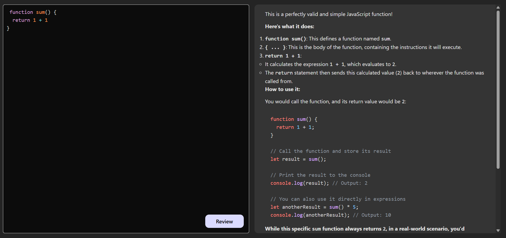

# 🤖 AI Code Reviewer

An intelligent code review assistant powered by **Google Gemini AI**. This application allows developers to input code snippets, receive instant feedback, identify bugs, and get suggestions for optimization—all within a clean, modern interface.



## 🚀 Features

-   **AI-Powered Review**: Uses Google Gemini 2.5 Flash to analyze code for errors, readability, and performance.
-   **Syntax Highlighting**: Beautiful code editor with `prismjs` (Tomorrow Night theme).
-   **Markdown Support**: The AI's response is rendered in clean Markdown with syntax highlighting for code blocks.
-   **Split Interface**: Side-by-side view of your code and the AI's feedback.

## 🛠️ Tech Stack

### Frontend
-   **React.js** (Vite)
-   **PrismJS** & **React Simple Code Editor** (For the code input)
-   **React Markdown** & **Rehype Highlight** (For rendering AI responses)
-   **Axios** (API requests)

### Backend
-   **Node.js** & **Express.js**
-   **Google Generative AI SDK** (Gemini)
-   **Cors** (Cross-Origin Resource Sharing)

---

## 🐳 How to Run (Docker)

The easiest way to run the application is using Docker. This ensures both frontend and backend run instantly without manual setup.

1.  **Prerequisites:** Ensure you have [Docker Desktop](https://www.docker.com/products/docker-desktop/) installed.
2.  **Clone the Repo:**
    ```bash
    git clone <your-repo-url>
    cd Code-Reviewer
    ```
3.  **Start the App:**
    Run this command in the root folder:
    ```bash
    docker-compose up --build
    ```
4.  **Access the App:**
    * **Frontend:** [http://localhost:5173](http://localhost:5173)
    * **Backend:** [http://localhost:5000](http://localhost:5000)

---

## 📂 Project Structure

```bash
Code-Reviewer/
├── BackEnd/        # Node.js API Server
│   ├── src/
│   │   ├── controllers/
│   │   ├── routes/
│   │   ├── services/
│   │   └── app.js
│   ├── server.js
│   ├── Dockerfile  # Docker setup for Backend
│   └── .env
├── Frontend/       # React Application
│   ├── src/
│   ├── package.json
│   └── Dockerfile  # Docker setup for Frontend
└── docker-compose.yml # Orchestration for both services